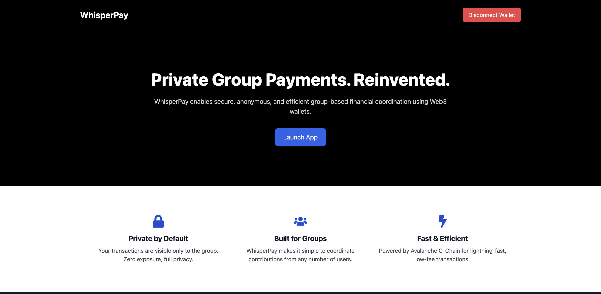

# WhisperPay - Privacy First Group Payments

#Live link - 

#Demo Video -

WhisperPay is a decentralized application (dApp) that enables secure, anonymous, and efficient group-based financial coordination using Avalanche Encrypted ERC functionality. Built on the Avalanche blockchain, it provides a privacy-focused solution for group payments, DAO operations, and team fund management.

## Features

### 🔒 Privacy by Default
- Private group transactions
- Stealth address routing using eERC20
- End-to-end encrypted balances and transactions
- Anonymous peer-to-peer payments

### 👥 Built for Groups
- Create & manage multiple group wallets
- Set target amounts and event due date
- Track contributions privately
- Ideal for DAOs, Group Events (Birthdays, Weddings, Parties, Get Togethers), and Team payments

### ⚡ Technical Features
- Built on Avalanche subnet chain (Private Network)
- Smart contract-based group management
- Real-time countdown timers for events
- Responsive design for mobile and desktop

## Getting Started

### Prerequisites
- Node.js (v14 or higher)
- Yarn package manager
- Web3 wallet (MetaMask, etc.)
- Avalanche Subnet

## Smart Contracts

The application interacts with two main smart contracts:

### GroupFactory Contract
- Address: `0x0807840D99a4d6077bd3544C0Dd957735Bfc8AdF`
- Creates and manages group instances
- Tracks all groups and their details

### Group Contract
- Deployed per group
- Manages individual group operations
- Handles group details (name, description, due date and target amounts)

## Technology Stack

- **Frontend**: React, Vite, TailwindCSS
- **Avalanche Encrypted ERC20 Standard** 
- **Web3**: Ethers.js, WAGMI
- **UI Components**: 
  - Framer Motion for animations
  - HeadlessUI for modals
  - React Hot Toast for notifications
  - React Calendar for event scheduling

## Features in Detail

### Group Creation
- Set group name and description
- Define target amount
- Set event due date

### Group Management
- View all groups
- Track contribution progress
- Real-time countdown timers
- Private contribution handling

### Privacy Features
- Anonymous contributions
- Encrypted balances and transactions
- Stealth transfers
- Private group metadata

## License

This project is licensed under the MIT License - see the [LICENSE](LICENSE) file for details.

## Security

WhisperPay prioritizes security and privacy. All transactions are:
- End-to-end encrypted
- Routed through stealth addresses
- Protected by smart contract validation
- Verified on the Avalanche blockchain (Subnet)

## Support

For support, please open an issue in the GitHub repository or contact the team at support@whisperpay.xyz